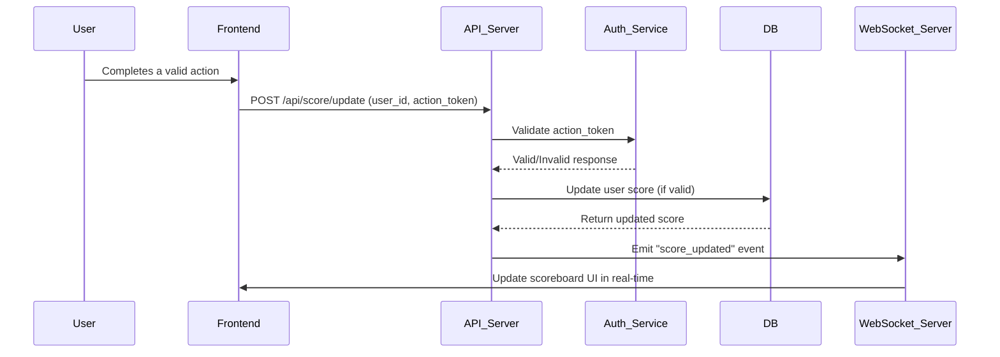

# Scoreboard Module Specification

## 1. Overview

This module is responsible for managing the **scoreboard system** of the website.  
It handles user score updates, real-time leaderboard updates, and security validation to prevent unauthorized score manipulation.

---

## 2. Functional Requirements

### 2.1 Core Features

1. Display the **top 10 users** with the highest scores.
2. Allow users to **increase their score** after completing a valid action.
3. Automatically **update the scoreboard in real-time** across all connected clients.
4. Validate **authorization and data integrity** before updating scores.

### 2.2 API Endpoints

#### `POST /api/score/update`

**Description:**  
Update a user's score after completing an authorized action.

**Request Example:**

```json
{
  "user_id": "12345",
  "action_token": "valid-signed-token"
}
```

**Process:**

1. Verify the action token to ensure the score update is legitimate.
2. Increase the user's score in the database.
3. Emit a real-time update event to notify all connected clients.

**Response Example:**

```json
{
  "status": "success",
  "new_score": 1550
}
```

#### `GET /api/scoreboard/top`

**Description:**  
Return the top 10 users with the highest scores.

**Response Example:**

```json
{
  "top_users": [
    { "user_id": "u001", "score": 2400 },
    { "user_id": "u002", "score": 2300 }
  ]
}
```

---

## 3. System Design

### 3.1 Components

| Component                             | Responsibility                                      |
| ------------------------------------- | --------------------------------------------------- |
| **API Gateway**                       | Handle incoming HTTP requests                       |
| **Auth Service**                      | Validate JWT or signed token for authorized actions |
| **Score Service**                     | Update and query user scores in the database        |
| **WebSocket/Socket.IO Server**        | Push real-time updates to all clients               |
| **Database (e.g., PostgreSQL/Redis)** | Store user score data efficiently                   |

---

## 4. Flow of Execution

### Diagram



---

## 5. Data Model

```sql
CREATE TABLE users (
  id SERIAL PRIMARY KEY,
  username VARCHAR(100),
  score INT DEFAULT 0,
  updated_at TIMESTAMP DEFAULT NOW()
);
```

Indexes:

- `INDEX (score DESC)` for efficient leaderboard queries.

---

## 6. Security Considerations

1. Use **JWT or signed token** to validate score updates.
2. Only allow score updates triggered by **verified actions**.
3. Rate-limit `/api/score/update` to prevent abuse.
4. Log suspicious activities (e.g., too many score updates).

---

## 7. Real-Time Communication

- Implement **WebSocket or Socket.IO** to push new score updates instantly.
- Broadcast “scoreboard_updated” events to all connected clients whenever a score changes.
- Client-side will re-render the top 10 leaderboard upon receiving the event.

---

## 8. Possible Improvements (Suggestions)

1. ✅ Add caching with **Redis** to improve leaderboard retrieval speed.
2. ✅ Implement **Event Queue (RabbitMQ/Kafka)** for async score processing.
3. ✅ Add **unit tests** and **integration tests** for score updates.
4. ✅ Create an **admin dashboard** to monitor leaderboard manipulation.
5. ✅ Add **cooldown time** for score updates to avoid spam actions.
